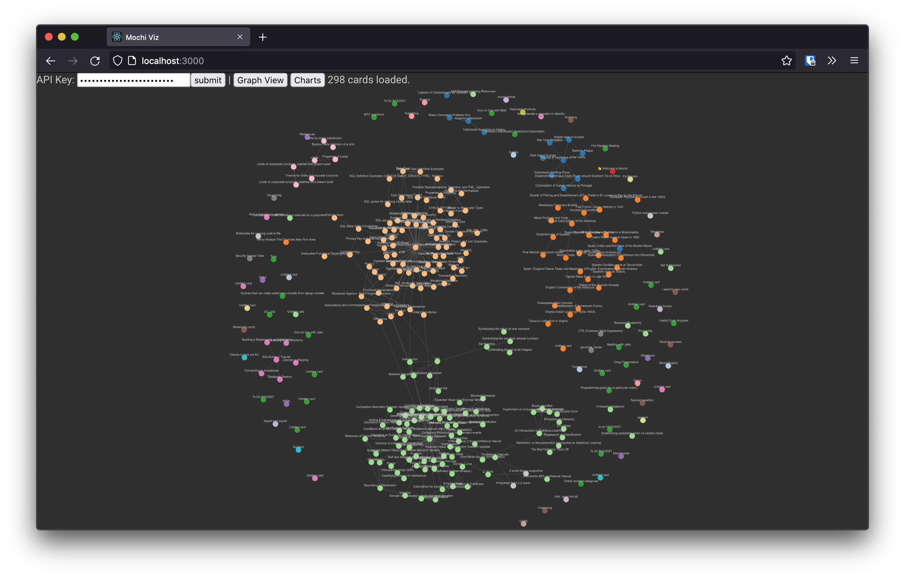
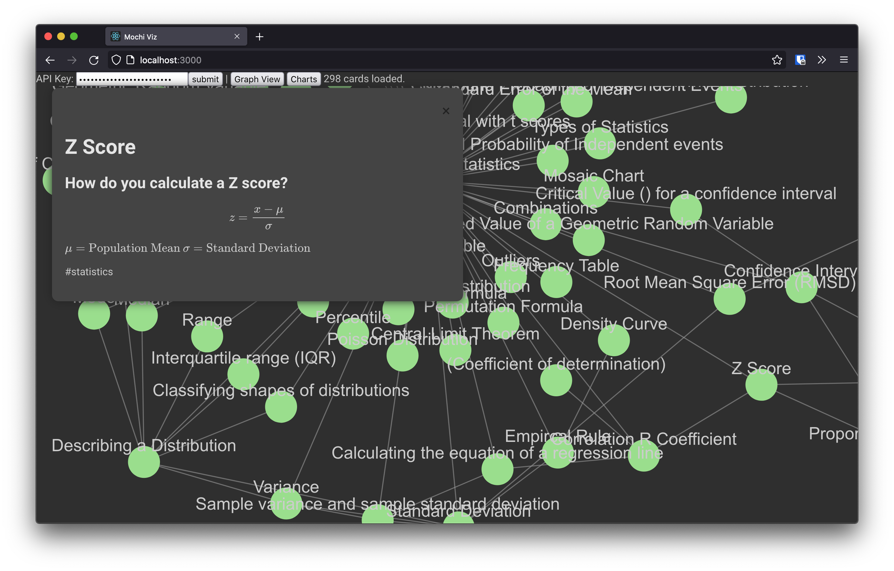

# mochi-viz
Additional views and charts to visualize data from [mochi.cards](https://mochi.cards/)


## Getting Started
This repository includes a react app (frontend), and a flask app (server) running in docker containers and networked using docker compose.  To run locally, ensure you have docker installed and follow these steps:
1. Clone this repository:
```
git clone https://github.com/zachflanders/mochi-viz.git
```
2. `cd` into the directory
```
cd mochi-viz
```
3. Build and run the application.
```
docker compose up -d
```
Once the application is running, use your [mochi api key](https://mochi.cards/docs/api/) to download your card and build the network view.
